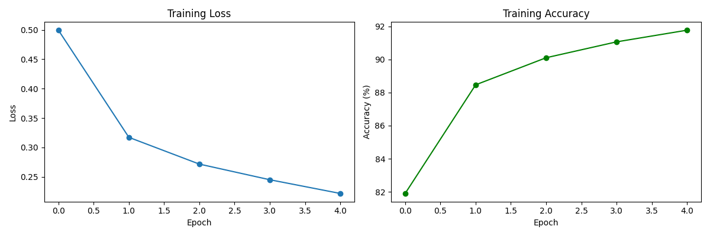
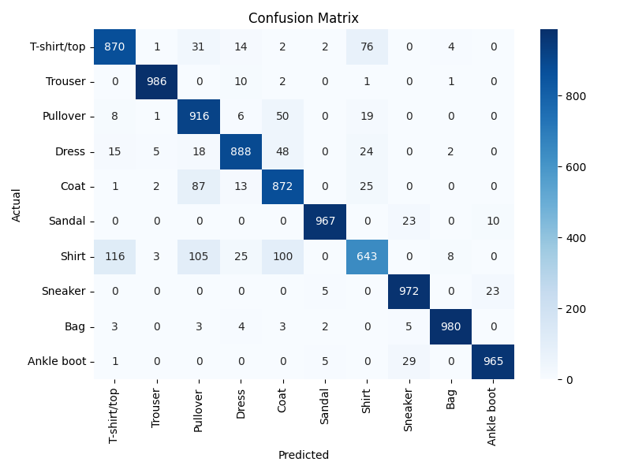
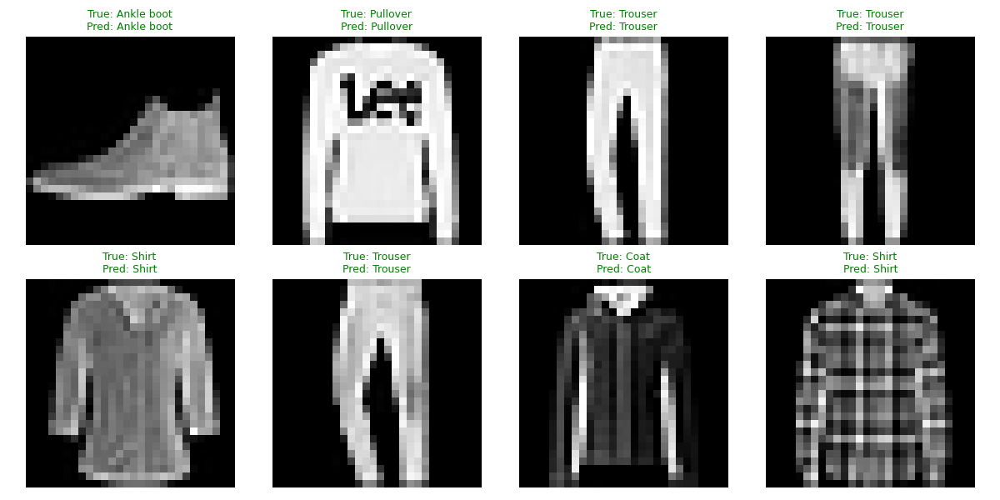
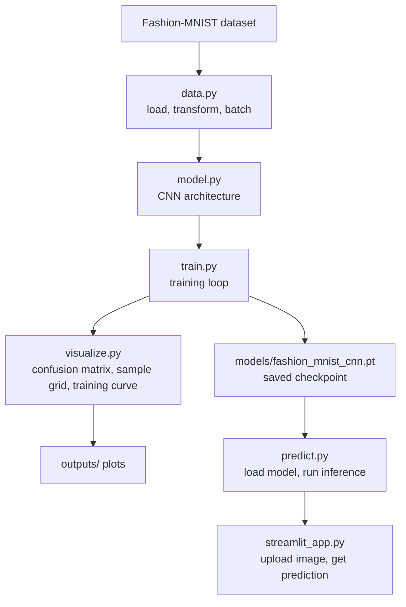

# Fashion-MNIST Classifier

A PyTorch CNN that classifies clothing images (Fashion-MNIST), with a Streamlit app for trying it out.

## About This Project

This was built as a deliberate first project to properly learn two things at once: the actual mechanics of a PyTorch training pipeline (tensors, CNNs, training loops), and a professional git workflow. Each feature (data pipeline, model, visualization, app) was built on its own branch, tested, and merged into `develop` via pull request, with `develop` merged into `main` once the full pipeline was verified end-to-end. The scope was kept small on purpose, so the focus stayed on doing both things properly rather than on model complexity.

## Results

A small CNN (2 convolutional layers + 2 fully connected layers) trained for 5 epochs on Fashion-MNIST reaches **~92% test accuracy**.





## Development Architecture

The codebase is organized into modular directories to separate data processing, modeling, training, and deployment logic:

```
fashion-mnist-classifier/
├── app/
│   └── streamlit_app.py   # Interactive web interface for inference
├── data/                  # Dataset storage and management
├── models/                # Saved model weights and checkpoints
├── notebooks/
│   └── exploration.ipynb  # Exploratory data analysis and prototyping
├── src/
│   ├── __init__.py
│   ├── data.py            # Data loading and preprocessing pipelines
│   ├── model.py           # Neural network architecture definitions
│   ├── predict.py         # Inference execution logic
│   ├── train.py           # Training and evaluation loops
│   └── visualize.py       # Plotting and visualization utilities
├── tests/
│   ├── __init__.py
│   ├── test_data.py       # Unit tests for data module
│   └── test_model.py      # Unit tests for model architecture
├── .gitignore             # Git ignore rules
├── requirements.txt       # Project dependencies
└── README.md
```

## ML Pipeline



## Setup

```bash
git clone https://github.com/SiddarthReddyK/fashion-mnist-classifier.git
cd fashion-mnist-classifier
python -m venv venv
venv\Scripts\activate        # Windows
# source venv/bin/activate   # Mac/Linux
pip install -r requirements.txt
```

## Usage

**Train the model** (downloads Fashion-MNIST automatically, saves weights + plots):

```bash
python -m src.train
```

**Run the interactive demo:**

```bash
streamlit run app/streamlit_app.py
```

Upload a clothing image and see the model's predicted class and confidence.

**Run the test suite:**

```bash
pytest
```

## Known Limitations

- The model is trained only on Fashion-MNIST's specific format: small (28x28), grayscale, centered product photos. Real-world photos (different lighting, background, angle) may reduce accuracy, since they differ significantly from the training distribution.
- No hyperparameter tuning was performed — this is a baseline CNN, not an optimized one.
